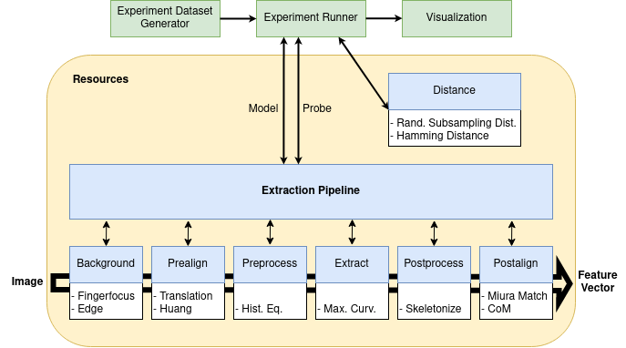

# README

## Table of Contents
1. [Project Overview and API](#example)
2. [Setting up Experiments](#setup-experiments)
3. [Running Experiments](#run-experiments)
4. [Adding a new Dataset](#add-dataset)
5. [Adding a new Pipeline Component](#add-pipeline-component)
6. [Visualizing Experiment Results](#visualize-experiments)
7. [Results of the Project](#experiment-results)

## Project Overview and API<a name="introduction"/>

The above image shows the structure of the project.
All blue rectangles are files located in the resources package of the project, together comprising all functionality
that is concerned with the biometric application. The green components represent the functionalities from the files 
*experiment_runner.py*, *experiment_setup.py* and *visualize.py*.

## Setting up Experiments <a name="setup-experiments"/>
The project provides a very useful tool to generate a csv file with all the model-probe-pairs that need to be compared for a given experiment.
This works by giving the specification of what pipeline configurations we want to run as well as giving hints about the data we want to use for the experiment.
For example, one can decide to only compare model-probe-pairs of the left hand, constrain it to a specific camera and so on.
The generated *setup.csv* file contains information about pairs that need to be compared. It is made sure that no duplicates exist
and that the images being compared are actually in the database.

#### File Structure:
I/O of experiment setup and conduction is kept in the *experiments* folder.
Each experiment is split into multiple *populations*, which represent the pipeline configurations that we want to compare.
The file *exp_specifications.json* is always present and should be updated when configuring a new population for an experiment.
All the other folders and files are generated automatically when calling the `setup_experiment` function.
```
alignment/
├─ experiments/
│  ├─ experiment_i/
│  │  ├─ population_i
│  │  │  ├─ spec.json
│  │  │  ├─ setup.csv
│  │  │
│  │  ├─ population_ii
│  │     ├─ spec.json
│  │     ├─ setup.csv
│  │  
│  ├─ exp_specifications.json
│
├─experiment_setup.py
 ```

####Setup API:
The file *experiment_setup.py* contains the function `setup_experiment(experiment_id, num_rows)`.
This function can be called in a python console and sets up a new population for the experiment referenced by the *experiment_id*.
If the experiment directory for the specific id does not exist yet, it is created along with the folder for the new population.
If some populations already exist in the experiment, the next free population identifier is picked for creation.
The *num_rows* parameter gives the option to sample only a subset of the set of all possible generated model-probe-pairs.
The configurations for all experiments are written into the *exp_specifications.json* file.

#### Example JSON Configuration:
The *spec* and *combination_param_pos* fields should be changed, the index will stay the same for each experiment (only needs to be changed
if the pipeline structure gets reworked).
```json
{ 
    "spec" : {
        "dataset_id": ["ii"],
        "distance_function": ["hamming_distance"],
        "mask": ["fingerfocus"],
        "prealign": ["id"],
        "preprocess": ["id"],
        "feature_extractor": ["maximum_curvature"],
        "postprocess": ["id"],
        "postalign": ["miura_matching"],
        "id_m": [],
        "id_p": [null],
        "side_m": ["left", "right"],
        "side_p": [null],
        "finger_m": ["index", "middle"],
        "finger_p": [null],
        "trial_m": [],
        "trial_p": [],
        "camera_m": [1,2],
        "camera_p": [null]
    },
    "idx" : {
        "dataset_id": 0,
        "distance_function": 1,
        "mask": 2,
        "prealign": 3,
        "preprocess": 4,
        "feature_extractor": 5,
        "postprocess": 6,
        "postalign": 7,
        "id_m": 8,
        "id_p": 9,
        "side_m": 10,
        "side_p": 11,
        "finger_m": 12,
        "finger_p": 13,
        "trial_m": 14,
        "trial_p": 15,
        "camera_m": 16,
        "camera_p": 17
    },
    "combination_param_pos": 14
}
```
  
The above configuration uses the dataset located under `dataset_ii/`. It runs a single pipeline configuration, i.e. each
functional unit has exactly one configuration (fingerfocus mask, id prealign, id preprocess, maximum curvature extractor, id postprocess and
miura matching postalign). Only model-probe-pairs are considered where model and probe are from the same finger 
(i.e. same side, same finger, same camera). Only the *trial* parameter varies, which is the index associated with the multiple shots
of the same finger. To ensure that there are no two images compared twice, the *combination_param_pos* is provided, indicating for which
attribute only unique combinations should be considered. The "idx" field of the specification file gives the translation
between attributes of "spec" and their positions. The _m and _p suffixes stand for model and probe respectively.

| Syntax                       | Description                                                                |
|------------------------------|----------------------------------------------------------------------------|
| "attribute": ["a", "b", "c"] | Use all of the listed items in the cartesian product.                      |
| "attribute": []              | Use all of the available options for "attribute" in the cartesian product. |
| "attrubute": [null]          | In each generated tuple use same as model for "attribute".                 |

## Running experiments <a name="run-experiments"/>
Running an experiment uses the `run_experiment(experiment_id)` function in `experiment_runer.py`.
It runs the experiment for all populations present for the given experiment identifier. For each population, it runs the 
entire pipeline twice for each model-probe-pair that is found in the spec.csv file. As this can lead to a lot of duplicate
computations, there is a `cache` flag that can be set to `True`. The `cache_path` should be updated to point to a local directory. WARNING: The cache size might become very large (orders of 10s of GB).
The function be simply run in a python console.

## Adding a new Dataset <a name="add-dataset"/>
Adding a new dataset is very easy. Simply add a folder with the name `dataset_ID` to the alignment folder,
replacing *ID* with a roman number that is still available. To use the dataset, the corresponding parameter can be adjusted in 
the `exp_specification.json` file when setting up an experiment.

## Adding a new Pipeline Component <a name="add-pipeline-component"/>


## Visualizing Experiment Results <a name="visualize-experiments"/>

## Results of the Project <a name="experiment-results"/>
